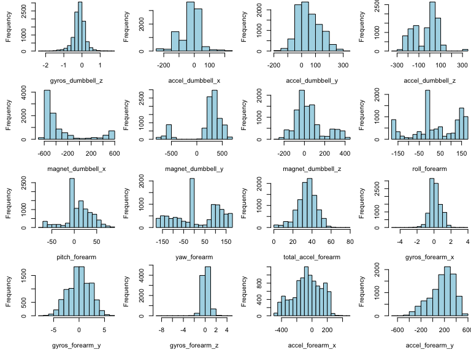

# The Manner of People in Exercise
X. C. Tian  
`r format(Sys.time(), '%d %B, %Y')`  

# Context
In this project, using the personal activity data collected by devices such as Jawbone Up, Nike FuelBand, and Fitbit, from accelerometers on the belt, forearm, arm, and dumbell of 6 participants, we are going to build a model that will be used to predict which activitiy it is (A, B, C, D, or E). The data used in this analysis is from [1].


```r
# enable multi-core processing
suppressPackageStartupMessages(library(doParallel))
cl <- makeCluster(detectCores())
registerDoParallel(cl)
```

# Getting and Cleaning data

```r
if (!file.exists("pml-training.csv")) {
    url="https://d396qusza40orc.cloudfront.net/predmachlearn/pml-training.csv"
    download.file(url, destfile="./pml-training.csv", method="curl")
    dateDownloaded <- date()
}
if (!file.exists("pml-testing.csv")) {
    url="https://d396qusza40orc.cloudfront.net/predmachlearn/pml-testing.csv"
    download.file(url, destfile="./pml-testing.csv", method="curl")
    dateDownloaded <- date()
}
# read in the data sets, both training and testing
training <- read.csv("pml-training.csv", na.strings=c("NA","","#DIV/0!"), sep=",")
testing  <- read.csv("pml-testing.csv",  na.strings=c("NA","","#DIV/0!"), sep=",")
# subset the data and keeps rows from 8 to the end
training <- training[,c(8:160)]
testing  <- testing[,c(8:160)]
# only keep the rows with less than 50% of missing values
col_to_keep = c()
for (i in 1:dim(training)[2]) {
  if ((sum(is.na(training[,i]))/nrow(training))<0.5) {
    col_to_keep <- append(col_to_keep, i)
  }
}
training <- training[,col_to_keep]
testing  <- testing[,col_to_keep]

# By looking at the fraction of NAs for each variables, it turns out there are no missing values
num_of_NAs = 0
for (i in 1:dim(training)[2]) {
  num_of_NAs = num_of_NAs + (sum(is.na(training[,i]))/nrow(training))
}
print (paste("The total number of columns in training dataset having NAs is", num_of_NAs))
```

```
## [1] "The total number of columns in training dataset having NAs is 0"
```

```r
num_of_NAs = 0
for (i in 1:dim(testing)[2]) {
  num_of_NAs = num_of_NAs + (sum(is.na(testing[,i]))/nrow(testing))
}
print (paste("The total number of columns in testing dataset having NAs is", num_of_NAs))
```

```
## [1] "The total number of columns in testing dataset having NAs is 0"
```

The idea is that if the fraction of missing values of a column is great than 50%, we will drop this column for downstream analysis. After the cleaning, there are 53 columns left including the outcome column "classe". A further check has been done and found no missing values in the tidy data so there is no need to impute the training and testing data set.

# Exploratory Data Analysis
See Appendix A.

# Machine Learning Model Building
## Model one: using all the variables as predictors
We first split the training dataset into two sub-dataset, for training and validation purposes.

```r
set.seed(201500)
inTrain    <- createDataPartition(y=training$classe, p=0.5, list=FALSE)
training   <- training[ inTrain,]
validation <- training[-inTrain,]
```

Using the training dataset, and 3-fold cross valiation algorithm, we fit the training dataset with Random Forest (rf) method, "classe" is the response, and using all the variables as predictors.

```r
set.seed(201501)
model1 <- train(classe ~ ., trControl=trainControl(method = "cv", number = 3), 
                method="rf", prox = TRUE, data = training)
print (model1$finalModel)
```

```
## 
## Call:
##  randomForest(x = x, y = y, mtry = param$mtry, proximity = TRUE) 
##                Type of random forest: classification
##                      Number of trees: 500
## No. of variables tried at each split: 27
## 
##         OOB estimate of  error rate: 1.03%
## Confusion matrix:
##      A    B    C    D    E class.error
## A 2785    3    2    0    0 0.001792115
## B   18 1874    7    0    0 0.013164824
## C    0   14 1688    9    0 0.013442431
## D    0    1   32 1574    1 0.021144279
## E    0    1    4    9 1790 0.007760532
```

```r
print(confusionMatrix(validation$classe, predict(model1, newdata=validation)), digits=4)
```

```
## Confusion Matrix and Statistics
## 
##           Reference
## Prediction    A    B    C    D    E
##          A 1395    0    0    0    0
##          B    0  945    0    0    0
##          C    0    0  852    0    0
##          D    0    0    0  779    0
##          E    0    0    0    0  927
## 
## Overall Statistics
##                                      
##                Accuracy : 1          
##                  95% CI : (0.9992, 1)
##     No Information Rate : 0.2848     
##     P-Value [Acc > NIR] : < 2.2e-16  
##                                      
##                   Kappa : 1          
##  Mcnemar's Test P-Value : NA         
## 
## Statistics by Class:
## 
##                      Class: A Class: B Class: C Class: D Class: E
## Sensitivity            1.0000   1.0000   1.0000    1.000   1.0000
## Specificity            1.0000   1.0000   1.0000    1.000   1.0000
## Pos Pred Value         1.0000   1.0000   1.0000    1.000   1.0000
## Neg Pred Value         1.0000   1.0000   1.0000    1.000   1.0000
## Prevalence             0.2848   0.1929   0.1739    0.159   0.1893
## Detection Rate         0.2848   0.1929   0.1739    0.159   0.1893
## Detection Prevalence   0.2848   0.1929   0.1739    0.159   0.1893
## Balanced Accuracy      1.0000   1.0000   1.0000    1.000   1.0000
```

Apply the first model to the testing dataset.

```r
answer <- predict(model1, newdata=testing)
print (answer)
```

```
##  [1] B A B A A E D B A A B C B A E E A B B B
## Levels: A B C D E
```
Using all the varialbes as predictors, the model predict the testing dataset 100% correct.

## Model two: pre-processing using principal components analysis
Data can contain variables that are highly correlated with each other. Many methods may perform better if highly correlated attributes are removed [2].


```r
correlationMatrix       <- abs(cor(training[,-53]))
diag(correlationMatrix) <- 0
which(correlationMatrix>0.8, arr.ind=T)
```

```
##                  row col
## yaw_belt           3   1
## total_accel_belt   4   1
## accel_belt_y       9   1
## accel_belt_z      10   1
## accel_belt_x       8   2
## magnet_belt_x     11   2
## roll_belt          1   3
## roll_belt          1   4
## accel_belt_y       9   4
## accel_belt_z      10   4
## pitch_belt         2   8
## magnet_belt_x     11   8
## roll_belt          1   9
## total_accel_belt   4   9
## accel_belt_z      10   9
## roll_belt          1  10
## total_accel_belt   4  10
## accel_belt_y       9  10
## pitch_belt         2  11
## accel_belt_x       8  11
## gyros_arm_y       19  18
## gyros_arm_x       18  19
## magnet_arm_x      24  21
## accel_arm_x       21  24
## magnet_arm_z      26  25
## magnet_arm_y      25  26
## accel_dumbbell_x  34  28
## accel_dumbbell_z  36  29
## pitch_dumbbell    28  34
## yaw_dumbbell      29  36
```
The above shows that there are many variables are highly correlated with each other, so we will preprocess the data with PCA.

```r
set.seed(201502)
model2 <- train(classe ~ ., preProcessing = "pca", trControl=trainControl(method = "cv", number = 3), 
                method="rf", prox = TRUE, data = training)
print (model2$finalModel)
```

```
## 
## Call:
##  randomForest(x = x, y = y, mtry = param$mtry, proximity = TRUE,      preProcessing = "pca") 
##                Type of random forest: classification
##                      Number of trees: 500
## No. of variables tried at each split: 27
## 
##         OOB estimate of  error rate: 1.01%
## Confusion matrix:
##      A    B    C    D    E class.error
## A 2785    3    2    0    0 0.001792115
## B   18 1874    7    0    0 0.013164824
## C    0   14 1688    9    0 0.013442431
## D    0    2   28 1577    1 0.019278607
## E    0    2    4    9 1789 0.008314856
```

```r
print(confusionMatrix(validation$classe, predict(model2, newdata=validation)), digits=4)
```

```
## Confusion Matrix and Statistics
## 
##           Reference
## Prediction    A    B    C    D    E
##          A 1395    0    0    0    0
##          B    0  945    0    0    0
##          C    0    0  852    0    0
##          D    0    0    0  779    0
##          E    0    0    0    0  927
## 
## Overall Statistics
##                                      
##                Accuracy : 1          
##                  95% CI : (0.9992, 1)
##     No Information Rate : 0.2848     
##     P-Value [Acc > NIR] : < 2.2e-16  
##                                      
##                   Kappa : 1          
##  Mcnemar's Test P-Value : NA         
## 
## Statistics by Class:
## 
##                      Class: A Class: B Class: C Class: D Class: E
## Sensitivity            1.0000   1.0000   1.0000    1.000   1.0000
## Specificity            1.0000   1.0000   1.0000    1.000   1.0000
## Pos Pred Value         1.0000   1.0000   1.0000    1.000   1.0000
## Neg Pred Value         1.0000   1.0000   1.0000    1.000   1.0000
## Prevalence             0.2848   0.1929   0.1739    0.159   0.1893
## Detection Rate         0.2848   0.1929   0.1739    0.159   0.1893
## Detection Prevalence   0.2848   0.1929   0.1739    0.159   0.1893
## Balanced Accuracy      1.0000   1.0000   1.0000    1.000   1.0000
```

Apply the second model to the testing dataset.

```r
answer <- predict(model2, newdata=testing)
print (answer)
```

```
##  [1] B A B A A E D B A A B C B A E E A B B B
## Levels: A B C D E
```

## Model three: selecting features based on their ranks

```r
# estimate variable importance
importance <- varImp(model1, scale=FALSE)
# summarize importance
print(importance)
```

```
## rf variable importance
## 
##   only 20 most important variables shown (out of 52)
## 
##                      Overall
## roll_belt              996.2
## pitch_forearm          588.1
## yaw_belt               543.6
## roll_forearm           468.4
## magnet_dumbbell_z      453.5
## magnet_dumbbell_y      441.5
## pitch_belt             410.4
## accel_dumbbell_y       244.2
## roll_dumbbell          202.9
## magnet_dumbbell_x      189.9
## accel_forearm_x        182.7
## magnet_belt_z          172.5
## accel_dumbbell_z       168.3
## magnet_forearm_z       153.9
## accel_belt_z           150.3
## total_accel_dumbbell   143.6
## magnet_belt_y          134.8
## gyros_belt_z           127.3
## yaw_arm                120.7
## magnet_belt_x          105.6
```

```r
# plot importance
plot(importance)
```

 

From the plot, let's use the top 10 features as the predictors.

```r
importance         <- varImp(model1)$importance
importance$varname <- rownames(importance) 
importance         <- importance[order(importance$Overall, decreasing=TRUE),]
impColName         <- importance[1:10,2]
```


```r
set.seed(201503)
training_sub <- training[,c(impColName, "classe")]
model3       <- train(classe ~ ., trControl=trainControl(method = "cv", number = 3), 
                      method="rf", prox = TRUE, data = training_sub)
print (model3$finalModel)
```

```
## 
## Call:
##  randomForest(x = x, y = y, mtry = param$mtry, proximity = TRUE) 
##                Type of random forest: classification
##                      Number of trees: 500
## No. of variables tried at each split: 6
## 
##         OOB estimate of  error rate: 2.03%
## Confusion matrix:
##      A    B    C    D    E class.error
## A 2763   16    9    1    1 0.009677419
## B   21 1828   32   15    3 0.037388099
## C    3   15 1674   18    1 0.021624781
## D    1    3   22 1579    3 0.018034826
## E    0   12   12   11 1769 0.019401330
```

```r
print(confusionMatrix(validation$classe, predict(model3, newdata=validation)), digits=4)
```

```
## Confusion Matrix and Statistics
## 
##           Reference
## Prediction    A    B    C    D    E
##          A 1395    0    0    0    0
##          B    0  945    0    0    0
##          C    0    0  852    0    0
##          D    0    0    0  779    0
##          E    0    0    0    0  927
## 
## Overall Statistics
##                                      
##                Accuracy : 1          
##                  95% CI : (0.9992, 1)
##     No Information Rate : 0.2848     
##     P-Value [Acc > NIR] : < 2.2e-16  
##                                      
##                   Kappa : 1          
##  Mcnemar's Test P-Value : NA         
## 
## Statistics by Class:
## 
##                      Class: A Class: B Class: C Class: D Class: E
## Sensitivity            1.0000   1.0000   1.0000    1.000   1.0000
## Specificity            1.0000   1.0000   1.0000    1.000   1.0000
## Pos Pred Value         1.0000   1.0000   1.0000    1.000   1.0000
## Neg Pred Value         1.0000   1.0000   1.0000    1.000   1.0000
## Prevalence             0.2848   0.1929   0.1739    0.159   0.1893
## Detection Rate         0.2848   0.1929   0.1739    0.159   0.1893
## Detection Prevalence   0.2848   0.1929   0.1739    0.159   0.1893
## Balanced Accuracy      1.0000   1.0000   1.0000    1.000   1.0000
```

Apply the third model to the testing dataset.

```r
answer<- predict(model3, newdata=testing)
print (answer)
```

```
##  [1] B A B A A E D B A A B C B A E E A B B B
## Levels: A B C D E
```


```r
# The stopCluster is necessary to terminate the extra processes
stopCluster(cl)
```

# Summary
We constructed 3 models using Random Forest, all of them give very low out of sample error (~0%) and very high accuracy (~100%). All three models give same correct predictions on the test dataset.

# References
[1] Velloso, E.; Bulling, A.; Gellersen, H.; Ugulino, W.; Fuks, H. Qualitative Activity Recognition of Weight Lifting Exercises. Proceedings of 4th International Conference in Cooperation with SIGCHI (Augmented Human '13) . Stuttgart, Germany: ACM SIGCHI, 2013.  
[2] http://machinelearningmastery.com/feature-selection-with-the-caret-r-package/.

# Appendix A

```r
par(mfrow=c(4,4))
par(mai=c(0.6,0.6,0,0))
tnames <- names(training)
for (i in 1:52) {
  hist(training[,i], xlab=tnames[i], col="lightblue", main="")
}
```


